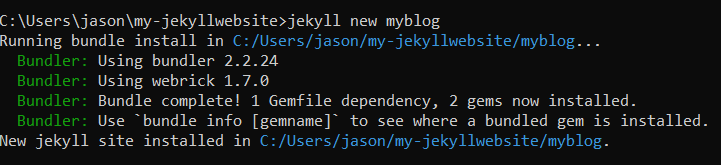

<h1>
GitHub Pages
</h>

<h2><b>GitHub Pages</b></h2>
 
<b>Step One:</b> Navigate your browser to your GitHub home page and create a new repository.  Do this by clicking the "New button on the left hand side of the page above the find repository search bar.

 
 

<b>Step Two:</b>On the next page, begin by creating a new repository by inputting a name for the repository.  Keep in mind that using special characters such as / or @ will create a - (New/Repo would become New-Rep).

Next choose to have your repository either as Public or Private by selecting a button.  For our example we will go public so our new GitHub page can be seen by the world.

Farther down on the same page you will have the options of adding a readme file, gitignore template and a choice of licenses.  Click add Readme file, for Gitignore select Node, and for license select MIT.

Click create repository at the bottom of the page.

 
<b>Step Three:</b>This page shows our newly constructed repository with our repo name, the readme file, license and gitignore we selected from the previous page.  Now on the navigation bar select settings on the far right side.

<b>Step Four:</b>Now navigate down the page until you reach the heading of GitHub Pages.  Note that this is pretty far down the page.  Find the link to page settings and click that.

<b>Step Five:</b>This next page will show you some important information.  The link of where your current GitHub page is currently hosted.  Where you can choose a theme for your page and also customize your domain name to add a more professional look.  Select the theme button next.

<b>Step Six:</b>By using the arrow buttons you can view stock themes that GitHub provides for free.  Choose a theme and click select theme to finalize. 

<h1>
Installing Jekyll and Ruby
</h1>
"Lasciate ogne speranza, voi ch'intrate" - Inferno by Dante Alighieri
 

Let us start this journey by heading to the [jekyll](https://jekyllrb.com/) website. Here we can find information, resources and news about Jekyll. Lets click Doc up in the nav bar.

From the documents page we can see the requirements Jekyll needs to work properly.  Just below that is a link 'See Requirements for guides and details'. Click [requirements](https://jekyllrb.com/docs/installation/#requirements).

Find the the guide on the page that pertains to your operating system. **Note this guild is only for the Windows install.**

Here we can find the link to latest ruby installer for windows.  This link will lead you away from the Jekyll website.

On the ruby installer website, just click either of the download buttons.  This will bring you to a list of versions of Ruby that you can download.

Well will want to download the latest version of Ruby + Devkit.  The Devkit installs useful add-ons which we can find helpful in our website building. Click the version link to start downloading. Take care on choosing the right x**-bit for your current system.  

You can find this information in your windows machine by going to ##Settings>About under device specifications.

Start the ruby installer and begin the installation process.  You will have to accept the license agreement to continue.

Make sure you select all the components listed on this page.

Choose your installation path and also ensure that the two options below the path are ticked.

Ensure that the tick box "Run installer" to set up MSYS2 and development toolchain is ticked.

Now come the part of installing the MSYS2 installation.  Once the Windows installer finishes a command terminal should open up. From the list of options choose number 3 "MSYS2 and MINGW development tools" and hit enter.  This may take a few moments.

Completed installation.

Next make a directory with the mkdir command - in the example it's my-jekyllwebsite in the user directory.  Changed into the directory with the cd command.  

Now run the command - jekyll new myblog

Next cd into myblog and now run - bundle install

next run the command - bundle add webrick

Now hopefully all you need to do is run - bundle exec jekyll serve --trace

The final results.

